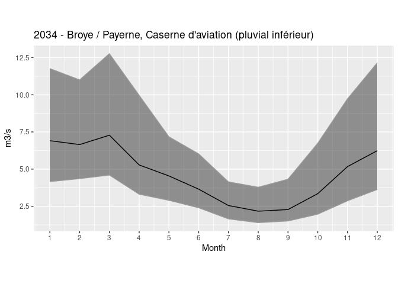
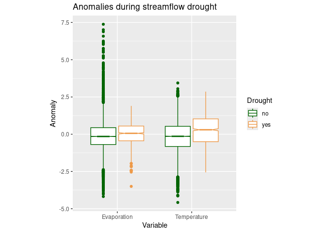

HYD-RESPONSES Code Examples
================
Christoph von Matt
2025-01-28

## Overview

This documents provides an exploratory overview of the main data
products provided within the HYD-RESPONSES dataset (see source). The
dataset consists of daily catchment-level time series data extracted
from gridded hydro-meteorological datasets provided by MeteoSwiss,
WSL/SLF and ECMWF. Further derived indicators related to snow, water
balance, streamflow and deficit accumulation (CWD, CPWD, CQWD, SPI,
SMRI, SPEI) are provided.

The code examples provide a guidance on:

- how to read-in the data
- how to combine data products
- how to select specific variables
- an example use and visualization of data

## Loading required libraries

``` r
# use package manager
if(!require("pacman")) install.packages("pacman")
```

    ## Loading required package: pacman

``` r
# load required libraries
pacman::p_load("ggplot2", "readr", "dplyr", "forcats", "tidyr", "lubridate",
                    "purrr", "stringr", "tibble", "sf")
```

## Folder structure

Data is stored in the folder `data` and contains subfolders for each
product and shapefiles for both catchment outlets and outlines.

Available subfolders are:

- `01_timeseries`: Time series data
- `02_climatology`: Climatological information for the reference period
  1991-2020
- `03_descriptive`: Information on catchment characteristics
  (climatological, terrestrial, …)

The ESRI-file format only allows for a limited number of characters for
column names. Both catchment outlets and outlines thus only contain the
geometries and catchment-identifiers (`ctchmnt`) and no additional
information to minimize information loss in column names. Renaming to
`catchmentnr` is suggested for cross-data compatibility.

``` r
# data directory
dir_data <- "../data/"
list.files(dir_data)
```

    ##  [1] "01_timeseries"          "02_climatology"         "03_descriptive"        
    ##  [4] "catchment_outlets.dbf"  "catchment_outlets.prj"  "catchment_outlets.shp" 
    ##  [7] "catchment_outlets.shx"  "catchment_outlines.dbf" "catchment_outlines.prj"
    ## [10] "catchment_outlines.shp" "catchment_outlines.shx"

``` r
# read-in catchment outlets
catchment_outlets <- read_sf(file.path(dir_data, "catchment_outlets.shp"))
catchment_outlets
```

    ## Simple feature collection with 184 features and 1 field
    ## Geometry type: POINT
    ## Dimension:     XY
    ## Bounding box:  xmin: 486600 ymin: 78320 xmax: 830800 ymax: 281975
    ## Projected CRS: CH1903 / LV03
    ## # A tibble: 184 × 2
    ##    ctchmnt        geometry
    ##    <chr>       <POINT [m]>
    ##  1 0070    (623610 200420)
    ##  2 0078    (803490 130520)
    ##  3 0155    (608220 223240)
    ##  4 0185    (757975 191925)
    ##  5 0308    (753190 261590)
    ##  6 0352    (718285 197310)
    ##  7 0403    (797700 168170)
    ##  8 0488    (610680 167840)
    ##  9 0491    (692480 191800)
    ## 10 2009    (557660 133280)
    ## # ℹ 174 more rows

``` r
# rename for compatibility
catchment_outlets <- catchment_outlets %>% 
  rename(catchmentnr = ctchmnt)
```

## Read-in data products

Starting from catchment outlets (or catchment outlines), data products
can be loaded and combined via the catchment identifiers.

All data files are stored as deliminator-separated csv-files (;) as
river and place name character strings contain commas.

``` r
# data directories
dir_timeseries <- file.path(dir_data, "01_timeseries")
dir_climatology <- file.path(dir_data, "02_climatology")
dir_descriptors <- file.path(dir_data, "03_descriptive")
```

### Catchment characteristics

It is generally a good idea to complement the catchment identifiers with
the general station information which contain basic catchment
characteristics (e.g., river and place name, catchment area, mean
height, glaciation percentage) but also information on the
**station-specific** streamflow time series availability. Data
availability is provided for the full (`start_date`) , continuous
(`start_date_continuous`) and homogeneous (`start_date_homogeneous`).
For catchments where neither breakpoints nor gaps were detected, the
availability is identical for all.

``` r
# check available files
list.files(dir_descriptors)
```

    ## [1] "HYDRESPONSES_descriptive_baseflowindex.csv"                    
    ## [2] "HYDRESPONSES_descriptive_climatological_info.csv"              
    ## [3] "HYDRESPONSES_descriptive_delayedflowindex.csv"                 
    ## [4] "HYDRESPONSES_descriptive_general_station_information.csv"      
    ## [5] "HYDRESPONSES_descriptive_hydro_geological_terrestrial_info.csv"
    ## [6] "HYDRESPONSES_descriptive_Q347.csv"

``` r
# complement catchment identifiers
catchment_outlets <- catchment_outlets %>% 
  left_join(
    read_delim(
      file.path(dir_descriptors, "HYDRESPONSES_descriptive_general_station_information.csv")
    )
  )
```

    ## Rows: 184 Columns: 25
    ## ── Column specification ────────────────────────────────────────────────────────
    ## Delimiter: ";"
    ## chr   (5): catchmentnr, water_name, place, startpoint_source, FOEN_regime_type
    ## dbl  (11): timespan_available_years, timespan_continuous_years, timespan_hom...
    ## lgl   (3): total_station, main_station, side_station
    ## date  (6): start_date, end_date, start_date_continuous, end_date_continuous,...
    ## 
    ## ℹ Use `spec()` to retrieve the full column specification for this data.
    ## ℹ Specify the column types or set `show_col_types = FALSE` to quiet this message.
    ## Joining with `by = join_by(catchmentnr)`

``` r
# information on data availability
catchment_outlets %>% 
  dplyr::select(catchmentnr, water_name, place, contains(c("start_date", "end_date"))) %>% 
  st_drop_geometry()
```

    ## # A tibble: 184 × 9
    ##    catchmentnr water_name  place                start_date start_date_continuous
    ##  * <chr>       <chr>       <chr>                <date>     <date>               
    ##  1 0070        Emme        Emmenmatt            1909-01-01 1909-01-01           
    ##  2 0078        Poschiavino Le Prese             1931-01-01 1931-01-01           
    ##  3 0155        Emme        Wiler, Limpachmündu… 1921-07-01 1921-07-01           
    ##  4 0185        Plessur     Chur                 1930-04-16 1930-04-16           
    ##  5 0308        Goldach     Goldach, Bleiche     1961-02-10 1961-02-10           
    ##  6 0352        Linth       Linthal, Ausgleichs… 1967-01-01 1967-01-01           
    ##  7 0403        Inn         Cinuos-chel          1974-01-01 1974-01-01           
    ##  8 0488        Simme       Latterbach           1985-05-01 1985-05-01           
    ##  9 0491        Schächen    Bürglen, Galgenwäld… 1986-01-01 1986-01-01           
    ## 10 2009        Rhône       Porte du Scex        1905-01-01 1905-01-01           
    ## # ℹ 174 more rows
    ## # ℹ 4 more variables: start_date_homogeneous <date>, end_date <date>,
    ## #   end_date_continuous <date>, end_date_homogeneous <date>

### Time series data

Time series are available for the following products:

- `01_base_variables`: basic (non-altered) hydro-meteorological
  variables extracted from gridded products
- `02_derived_variables`: information derived from basic variables on
  snow ($\Delta$SWE), water balance (P-E) and streamflow (7d average
  streamflow) and combinations thereof
- `03_anomalies`: standardized anomalies (z-scores: (value - mean)/sd))
  for all variables across products and for multiple scales (daily,
  monthly: 31d, seasonal: 91d)
- `04_standardized_indices`: Time series of SPI, SPEI and SMRI
- `05_cumulative_deficits`: cumulative deficits of (potential) water
  balance and streamflow time series
- `06_events_nrs`: Time series of numbered streamflow drought events
  based on variable and fixed threshold definitions (values below
  threshold)

``` r
# check available files
list.files(dir_timeseries)
```

    ## [1] "01_base_variables"       "02_derived_variables"   
    ## [3] "03_anomalies"            "04_standardized_indices"
    ## [5] "05_cumulative_deficits"  "06_events_nrs"

Monthly standardized anomalies are loaded for example catchment *2034 -
Broye, Payerne (Caserne d’ aviation)* which will be used for
demonstration in the remaining part of this guide on the HYD-RESPONSES
dataset. Note that only the data is only used for the homogeneous
streamflow period.

``` r
# check available files
list.files(file.path(dir_timeseries, "03_anomalies", "zscores")) %>%
  head(10)
```

    ##  [1] "HYDRESPONSES_zscores_scale_1_catchment_0070.csv"
    ##  [2] "HYDRESPONSES_zscores_scale_1_catchment_0078.csv"
    ##  [3] "HYDRESPONSES_zscores_scale_1_catchment_0155.csv"
    ##  [4] "HYDRESPONSES_zscores_scale_1_catchment_0185.csv"
    ##  [5] "HYDRESPONSES_zscores_scale_1_catchment_0308.csv"
    ##  [6] "HYDRESPONSES_zscores_scale_1_catchment_0352.csv"
    ##  [7] "HYDRESPONSES_zscores_scale_1_catchment_0403.csv"
    ##  [8] "HYDRESPONSES_zscores_scale_1_catchment_0488.csv"
    ##  [9] "HYDRESPONSES_zscores_scale_1_catchment_0491.csv"
    ## [10] "HYDRESPONSES_zscores_scale_1_catchment_2009.csv"

``` r
# select example catchment
catchment_2034 <- catchment_outlets %>% 
  filter(catchmentnr == "2034")

# load the monthly (31d = scale_31) anomalies and filter only for the homogeneous streamflow period
data_anomalies <- read_delim(
  file.path(
    dir_timeseries, "03_anomalies", "zscores", "HYDRESPONSES_zscores_scale_31_catchment_2034.csv"
  )
) %>% 
  filter(date >= catchment_2034$start_date_homogeneous)
```

    ## Rows: 38138 Columns: 91
    ## ── Column specification ────────────────────────────────────────────────────────
    ## Delimiter: ";"
    ## chr   (2): place, water_name
    ## dbl  (88): catchmentnr, doy, Q_standardized_anomaly_31, t2m_mean_mean_standa...
    ## date  (1): date
    ## 
    ## ℹ Use `spec()` to retrieve the full column specification for this data.
    ## ℹ Specify the column types or set `show_col_types = FALSE` to quiet this message.

### Climatology

Each catchment is classified by a specific streamflow regime type which
is available in the already loaded general catchment characteristics
(`FOEN_regime_type`). For catchment 2034, the characteristic streamflow
regime is characterized as **pluvial inférieur**. Streamflow regime
types are classified by considering the annual streamflow climatology.

Data on climatologies for all time series products are provided both
DOY-based (for each day of the year, folder “DOY_movingwindow”) and
regular. DOY-based climatologies were assessed by using a moving window
centered on the specific day for the specific scale (e.g., monthly =
day - 15 to day + 15). Regular climatologies are provided per month,
season, extended season and yearly.

To get an impression of how the characteristic streamflow regime type
looks like, we first load the regular climatology and visualize the
monthly mean streamflow levels.

(This may take some seconds longer as climatologies provide a
comprehensive set of statistics…)

``` r
# check available files
list.files(file.path(dir_climatology, "regular")) %>% 
  head(10)
```

    ##  [1] "HYDRESPONSES_climatology_regular_catchment_0070.csv"
    ##  [2] "HYDRESPONSES_climatology_regular_catchment_0078.csv"
    ##  [3] "HYDRESPONSES_climatology_regular_catchment_0155.csv"
    ##  [4] "HYDRESPONSES_climatology_regular_catchment_0185.csv"
    ##  [5] "HYDRESPONSES_climatology_regular_catchment_0308.csv"
    ##  [6] "HYDRESPONSES_climatology_regular_catchment_0352.csv"
    ##  [7] "HYDRESPONSES_climatology_regular_catchment_0403.csv"
    ##  [8] "HYDRESPONSES_climatology_regular_catchment_0488.csv"
    ##  [9] "HYDRESPONSES_climatology_regular_catchment_0491.csv"
    ## [10] "HYDRESPONSES_climatology_regular_catchment_2009.csv"

``` r
# load regular climatology
data_clim <- read_delim(
  file.path(
    dir_climatology, "regular", "HYDRESPONSES_climatology_regular_catchment_2034.csv"
  )
)
```

    ## Rows: 19 Columns: 951
    ## ── Column specification ────────────────────────────────────────────────────────
    ## Delimiter: ";"
    ## chr   (3): time_scale, season, extended_season
    ## dbl (948): catchmentnr, month, M7Q_min, M7Q_q05, M7Q_q25, M7Q_med, M7Q_mean,...
    ## 
    ## ℹ Use `spec()` to retrieve the full column specification for this data.
    ## ℹ Specify the column types or set `show_col_types = FALSE` to quiet this message.

``` r
data_clim
```

    ## # A tibble: 19 × 951
    ##    catchmentnr time_scale   month season extended_season M7Q_min M7Q_q05 M7Q_q25
    ##          <dbl> <chr>        <dbl> <chr>  <chr>             <dbl>   <dbl>   <dbl>
    ##  1        2034 monthly          1 <NA>   <NA>               1.94    2.59    4.61
    ##  2        2034 monthly          2 <NA>   <NA>               1.89    2.51    4.66
    ##  3        2034 monthly          3 <NA>   <NA>               2.18    3.18    4.93
    ##  4        2034 monthly          4 <NA>   <NA>               1.7     2.48    3.51
    ##  5        2034 monthly          5 <NA>   <NA>               1.06    2.16    3.21
    ##  6        2034 monthly          6 <NA>   <NA>               1.22    1.82    2.67
    ##  7        2034 monthly          7 <NA>   <NA>               0.68    1.14    1.76
    ##  8        2034 monthly          8 <NA>   <NA>               0.41    0.98    1.58
    ##  9        2034 monthly          9 <NA>   <NA>               0.63    1.02    1.73
    ## 10        2034 monthly         10 <NA>   <NA>               0.51    1.16    2.19
    ## 11        2034 monthly         11 <NA>   <NA>               0.77    1.22    3.29
    ## 12        2034 monthly         12 <NA>   <NA>               1.72    2.37    4.03
    ## 13        2034 seasonal        NA DJF    <NA>               1.72    2.46    4.48
    ## 14        2034 seasonal        NA JJA    <NA>               0.41    1.16    1.94
    ## 15        2034 seasonal        NA MAM    <NA>               1.06    2.46    3.71
    ## 16        2034 seasonal        NA SON    <NA>               0.51    1.15    2.14
    ## 17        2034 extended_se…    NA <NA>   summer             0.41    1.18    2.07
    ## 18        2034 extended_se…    NA <NA>   winter             0.77    2.36    4.16
    ## 19        2034 yearly          NA <NA>   <NA>               0.41    1.36    2.76
    ## # ℹ 943 more variables: M7Q_med <dbl>, M7Q_mean <dbl>, M7Q_q75 <dbl>,
    ## #   M7Q_q95 <dbl>, M7Q_max <dbl>, M7Q_sd <dbl>, M7Q_sum <dbl>,
    ## #   M7Q_n_years <dbl>, P_SMLT_OSHDromc_min <dbl>, P_SMLT_OSHDromc_q05 <dbl>,
    ## #   P_SMLT_OSHDromc_q25 <dbl>, P_SMLT_OSHDromc_med <dbl>,
    ## #   P_SMLT_OSHDromc_mean <dbl>, P_SMLT_OSHDromc_q75 <dbl>,
    ## #   P_SMLT_OSHDromc_q95 <dbl>, P_SMLT_OSHDromc_max <dbl>,
    ## #   P_SMLT_OSHDromc_sd <dbl>, P_SMLT_OSHDromc_sum <dbl>, …

The files containing climatological information contain climatologies
for all scales and the desired scale has to be selected before use
(`time_scale`). Note that depending on scale, either the columns month,
season or extended_season contain the information on the specific
category. For a monthly climatology this corresponds to the month
(1–12), for season to *DJF* (winter), *MAM* (spring), *JJA* (summer) and
*SON* (autumn) and for extended_season *summer* (May – October) and
*winter* (November – March). The DOY-based climatology does instead
provide information DOY and the time scale specifies the moving-window
size (e.g., daily = 1, monthly = 31, seasonal = 91, extended season =
183).

Here, we are only interested in the monthly streamflow (*Q*)
climatology.

``` r
# filter monthly climatology
data_clim_monthly <- data_clim %>% 
  filter(time_scale == "monthly")


# visualize the monthly streamflow climatology
ggplot(data_clim_monthly) +
  # visualize the IQR
  geom_ribbon(
    aes(month, ymin = Q_q25, ymax = Q_q75),
    alpha = 0.5, color = "grey60"
  ) +
  # visualize the monthly median streamflow
  geom_line(
    aes(month, Q_med)
  ) +
  scale_x_continuous("Month", breaks = 1:12) +
  scale_y_continuous("m3/s") +
  labs(
    # use catchment descriptors for title
    title = str_c(
      catchment_2034$catchmentnr, " - ", catchment_2034$water_name, " / ",
      catchment_2034$place, 
      " (", catchment_2034$FOEN_regime_type, ")"
    )
  ) +
  coord_fixed(ratio = 0.5)
```

<!-- -->

### Streamflow drought events

Time series on events defined by fixed and variable threshold
definitions are provided for streamflow droughts (`hydrological_events`)
and for cumulative deficits for both streamflow (*CQWD*) and (potential)
water balance (*CWD* and *CPWD*). For the subsequent analysis we are
interested in streamflow droughts phases.

``` r
# check streamflow drought files
list.files(file.path(dir_timeseries, "06_events_nrs", "hydrological_events")) %>% 
  head(10)
```

    ##  [1] "HYDRESPONSES_eventseries_hydroevents_catchment_0070.csv"
    ##  [2] "HYDRESPONSES_eventseries_hydroevents_catchment_0078.csv"
    ##  [3] "HYDRESPONSES_eventseries_hydroevents_catchment_0155.csv"
    ##  [4] "HYDRESPONSES_eventseries_hydroevents_catchment_0185.csv"
    ##  [5] "HYDRESPONSES_eventseries_hydroevents_catchment_0308.csv"
    ##  [6] "HYDRESPONSES_eventseries_hydroevents_catchment_0352.csv"
    ##  [7] "HYDRESPONSES_eventseries_hydroevents_catchment_0403.csv"
    ##  [8] "HYDRESPONSES_eventseries_hydroevents_catchment_0488.csv"
    ##  [9] "HYDRESPONSES_eventseries_hydroevents_catchment_0491.csv"
    ## [10] "HYDRESPONSES_eventseries_hydroevents_catchment_2009.csv"

``` r
# load streamflow drought event time series
data_droughts <- read_delim(
  file.path(
    dir_timeseries, "06_events_nrs", "hydrological_events", "HYDRESPONSES_eventseries_hydroevents_catchment_2034.csv"
  )
)
```

    ## Rows: 38138 Columns: 32
    ## ── Column specification ────────────────────────────────────────────────────────
    ## Delimiter: ";"
    ## dbl  (31): catchmentnr, M7Q_Q347_0_event_nr, M7Q_Q347_0_event_days_cumulativ...
    ## date  (1): date
    ## 
    ## ℹ Use `spec()` to retrieve the full column specification for this data.
    ## ℹ Specify the column types or set `show_col_types = FALSE` to quiet this message.

Streamflow drought event series are available for variable and fixed
threshold definitions. Variable thresholds include monthly (`perc_31`)
and seasonal (`perc_91`) percentiles. The only fixed threshold is the
`Q347` which corresponds roughly to a yearly 5th-percentile derived
based on the flow duration curve (FDC).

Here we use the yearly Q347-based streamflow drought series derived from
7 daily average streamflow (M7Q) series (`M7Q_Q347_0`).

Each event definition has two columns. In columns with `_event_nr`,
drought phases are successively numbered while in columns with
`_event_days_cumulative` days below the threshold are successively
numbered per drought phase.

Example:  
NA NA NA 1 1 1 NA NA 2 2 NA NA (`event_nr`)  
NA NA NA 1 2 3 NA NA 1 2 NA NA (`event_days_cumulative`)

``` r
# available event series
data_droughts %>% 
  colnames()
```

    ##  [1] "catchmentnr"                             
    ##  [2] "date"                                    
    ##  [3] "M7Q_Q347_0_event_nr"                     
    ##  [4] "M7Q_Q347_0_event_days_cumulative"        
    ##  [5] "M7Q_mean_perc_31_0_event_nr"             
    ##  [6] "M7Q_mean_perc_31_0_event_days_cumulative"
    ##  [7] "M7Q_mean_perc_91_0_event_nr"             
    ##  [8] "M7Q_mean_perc_91_0_event_days_cumulative"
    ##  [9] "M7Q_med_perc_31_0_event_nr"              
    ## [10] "M7Q_med_perc_31_0_event_days_cumulative" 
    ## [11] "M7Q_med_perc_91_0_event_nr"              
    ## [12] "M7Q_med_perc_91_0_event_days_cumulative" 
    ## [13] "M7Q_q02_perc_31_0_event_nr"              
    ## [14] "M7Q_q02_perc_31_0_event_days_cumulative" 
    ## [15] "M7Q_q02_perc_91_0_event_nr"              
    ## [16] "M7Q_q02_perc_91_0_event_days_cumulative" 
    ## [17] "M7Q_q05_perc_31_0_event_nr"              
    ## [18] "M7Q_q05_perc_31_0_event_days_cumulative" 
    ## [19] "M7Q_q05_perc_91_0_event_nr"              
    ## [20] "M7Q_q05_perc_91_0_event_days_cumulative" 
    ## [21] "M7Q_q10_perc_31_0_event_nr"              
    ## [22] "M7Q_q10_perc_31_0_event_days_cumulative" 
    ## [23] "M7Q_q10_perc_91_0_event_nr"              
    ## [24] "M7Q_q10_perc_91_0_event_days_cumulative" 
    ## [25] "M7Q_q15_perc_31_0_event_nr"              
    ## [26] "M7Q_q15_perc_31_0_event_days_cumulative" 
    ## [27] "M7Q_q15_perc_91_0_event_nr"              
    ## [28] "M7Q_q15_perc_91_0_event_days_cumulative" 
    ## [29] "M7Q_q25_perc_31_0_event_nr"              
    ## [30] "M7Q_q25_perc_31_0_event_days_cumulative" 
    ## [31] "M7Q_q25_perc_91_0_event_nr"              
    ## [32] "M7Q_q25_perc_91_0_event_days_cumulative"

``` r
# select events based on a yearly fixed threshold definition (Q347)
data_droughts <- data_droughts %>% 
  dplyr::select(catchmentnr, date, contains("M7Q_Q347")) %>% 
  # again: filter homogeneous time series
  filter(date >= catchment_2034$start_date_homogeneous)
```

## Example streamflow drought analysis

In the last section, potential use cases and combination possibilities
are demonstrated by analysing the temperature, precipitation and
evaporation anomalies during streamflow drought events for the catchment
*2034 - Broye, Payerne*.

### Combining datasets

The previously loaded anomalies can easily be combined with the
streamflow drought event series as both all time series products share
the columns `catchmentnr` and `date`.

Note that for some datasets additional variables may be required for
combination which in some cases must be manually created. For example to
add DOY-based climatologies, both datasets must also contain the
variable `doy` (day of year) which can be added via
`mutate(doy = lubridate::yday(date))`).

``` r
# combine anomalies with event series
data_combined <- data_anomalies %>% 
  left_join(data_droughts)
```

    ## Joining with `by = join_by(catchmentnr, date)`

### Composite analysis: Hydro-meteorological indicators during streamflow droughts

The time series now contain information on both the “normality” (or
anomalousness) of the hydro-meteorological conditions as well as the
dates where streamflow droughts occured. An interesting question now be
if hydro-meteorological conditions differ between drought and
non-drought phases. Further, hydro-meteorological conditions may also be
more extreme for longer streamflow droughts.

Here, we compare values between drought and non-drought phases for
monthly (31d) temperature and evaporation anomalies. Note that
temperature and evaporation originate from different gridded datasets.
Here the data availability is longest for the streamflow time series
(`start_date_homogeneous = 1924-12-31`). The HYD-RESPONSES data provides
ERA5-LAND data from 1950 onwards. The MeteoSwiss TabsD product (daily
average temperature) has the shortest data availability and starts in
1961. Events can therefore only be analysed after 1961.

Boxplots for both temperature and evaporation show higher values during
streamflow droughts and also boxplot-notches do not overlap!

``` r
data_combined %>% 
  # ensure data coverage for all products
  filter(date >= dmy("01-01-1961")) %>% 
  dplyr::select(
    # keep information on drought phases
    contains(c("_event_nr", "event_days_cumulative")),
    # select monthly anomalies of temperature and evaporation
    TabsD_mean_standardized_anomaly_31,
    e_mean_mean_standardized_anomaly_31
  ) %>% 
  rename(
    event_nr = M7Q_Q347_0_event_nr,
    event_days_cumulative = M7Q_Q347_0_event_days_cumulative,
    Temperature = TabsD_mean_standardized_anomaly_31,
    Evaporation = e_mean_mean_standardized_anomaly_31
  ) %>% 
  # create a helper variable for drought / non-drought
  mutate(
    drought = !is.na(event_nr)
  ) %>% 
  # pivot for plotting
  pivot_longer(
    c("Temperature", "Evaporation")
  ) %>% 
  # visualize anomaly values
  ggplot() +
  geom_boxplot(
    aes(name, value, color = drought),
    notch = TRUE
  ) +
  ylab("Anomaly") + 
  xlab("Variable") +
  scale_color_manual(
    "Drought", 
    values = c("darkgreen", "tan2"), 
    labels = c("no", "yes")
  ) +
  labs(title = "Anomalies during streamflow drought") +
  coord_fixed(ratio = 0.2)
```

    ## Warning: Removed 122 rows containing non-finite outside the scale range
    ## (`stat_boxplot()`).

<!-- -->

You have reached the end of this tutorial!

More detailed information can be found in the HYD-RESPONSES
documentation (Link).

Thank you for reading and have fun with the HYD-RESPONSES dataset! :-)
